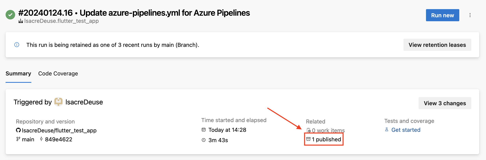
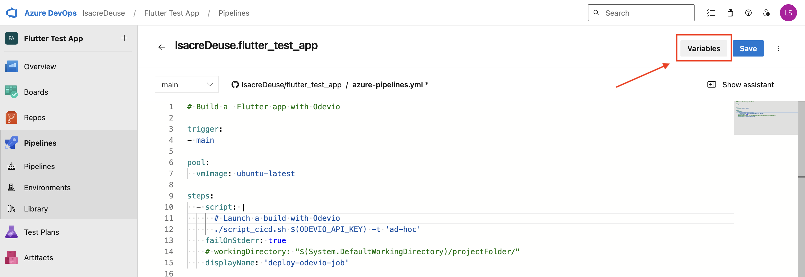
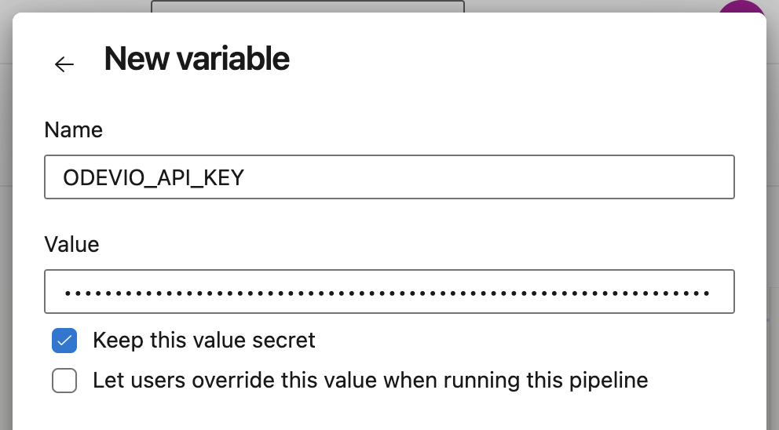
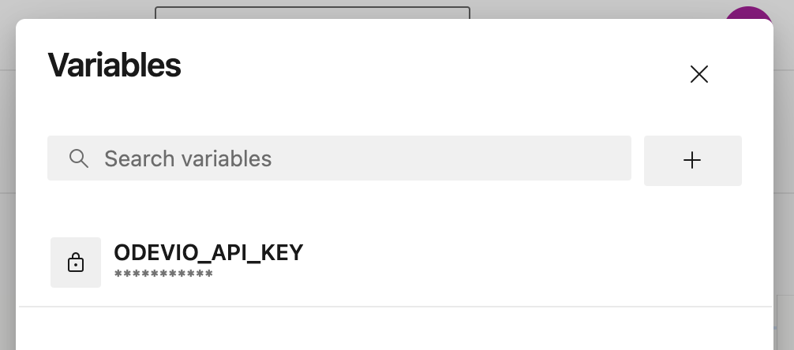

# Integrate Odevio in an Azure DevOps pipeline

This file explains how a user can integrate Odevio in a pipeline of their Azure DevOps repository in order to build an application made with Flutter for iOS.

If the build type is publication is also publishes it to AppStoreConnect.

## Generate an API key for Odevio

### Via the Desktop

Go to the Profile tab via the navigation bar, then click on the button `Generate new API key`. Beware, your API key will only be shown once. Copy it and save it in a safe place.

### Via the CLI

Follow the instructions [here](https://odevio-cli.readthedocs.io/en/latest/installation_cli/reference_guide_cli/index.html#odevio-apikey-new).

## Configure your pipeline

The workflow of your CI/CD is governed by the file `azure-pipelines.yml` in Azure DevOps. This file describe the different stages and what happens in each of them. The documentation about pipelines is available [here](https://learn.microsoft.com/en-us/azure/devops/pipelines).

If you already have a pipeline in your repository, you can skip the next section.

### Getting started with Azure DevOps pipelines

Azure DevOps provides a *Getting-Started* example of a pipeline [here](https://learn.microsoft.com/en-us/azure/devops/pipelines/create-first-pipeline) and customize the YAML file [here](https://learn.microsoft.com/en-us/azure/devops/pipelines/customize-pipeline). You can start by playing with this file as your `azure-pipelines.yml` file to understand how the pipeline works.

In Azure DevOps, a pipeline is composed of [stages](https://learn.microsoft.com/en-us/azure/devops/pipelines/process/stages?view=azure-devops&tabs=yaml) that are executed sequentially. Each stage contains one or more jobs that can run in parallel. Jobs within a stage are independent, meaning they can execute concurrently. Additionally, each job runs on a separate agent. These agents can be hosted by Azure DevOps or on your own infrastructure.

### Example of pipeline using Odevio

In the file `azure-pipelines.yml`, we give an example of what a pipeline that integrates Odevio can look like. The file is an adaptation of the starter pipeline of Azure DevOps pipeline, a minimal pipeline that you can customize to build and deploy your code and that has one implicit stage and one implicit job.

Here, the job is composed of only one step `deploy-odevio-job` that has for objective to run the script `script_cicd.sh`. The image used is `ubuntu-lastest`. The script is launched within the section `script`. The `script_cicd.sh` is called with the API key of Odevio that you should set as a CI/CD variable before. It will be explained in the next section. The YAML file supposes that the `script_cicd.sh` is at the root of your project. Do not hesitate to use the `workingDirectory` to specify another location.

The script can be launched with two optional parameters:
- `-d|--directory`      Specifies the directory of the flutter project in the current directory. It has to end with '/'. Default: './'
- `-t|--build-type`     Selects the build type used on Odevio. Choices are: 'ad-hoc', 'publication'. Default: 'publication'.
- `-k|--app-key`        Specifies the app key of the application on Odevio.
- `-fv|--flutter-version`     Specifies the flutter version used on Odevio.
- `-iv|--minimal-ios-version` Specifies the minimal iOS version used on Odevio. If not specified, the minimal iOS version will be read from the .odevio file.
- `-m|--mode`           Specifies the mode used on Odevio.
                        Choices are: 'debug', 'profile', 'release'.
- `-tg|--target`        Specifies the target used on Odevio.
- `-f|--flavor`         Specifies the flavor used on Odevio.

The first optional parameter can be used if your flutter directory is not at the root of your repository. The second one selects the type of build that will be used on Odevio. You may start with the build type `ad-hoc` when setting up your pipeline or if you want to create an IPA file. With this build type, if the build has succeeded, the url where the IPA file generated by Odevio is made available in a text file `odevio_ipa_url.txt`. The file is published as an artifact thanks to the task `PublishBuildArtifacts@1`. Once the build is finished, the file can be found here:

The `app-key`, `flutter-version`, `minimal-ios-version`, `mode`, `target` and `flavor` argument can be read from the `.odevio` file. The arguments of the script overwrite the values present in the `.odevio` file.

The parameter `app-key` and `flutter-version` must be specified by either the argument of the scirpt or by the `.odevio` file.

#### Add your API key to the pipeline

When editing your pipeline configuration file, you can add a variable by clicking on the `Variables` button.

Then, you just have to enter the name of your variable (in our config file, we are calling it `ODEVIO_API_KEY`) and its value. Keep this value secret, it is better.

Finally, you should see your variable appear in the list (don't forget to save before closing the modal).

