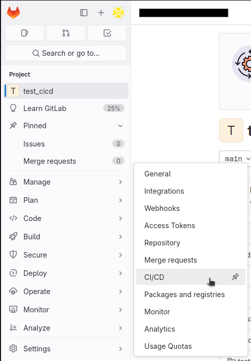
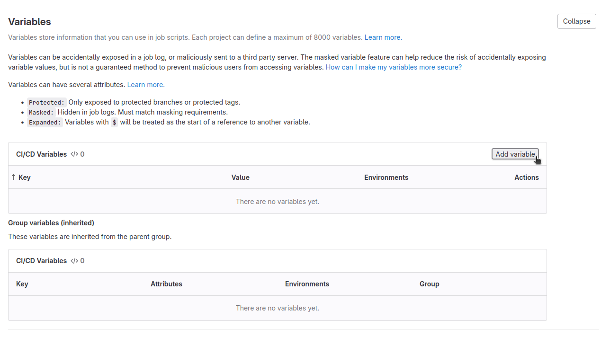
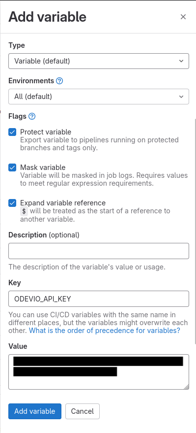

# Instruction to integrate Odevio in a GitLab pipeline

This file explains how a user can integrate Odevio in a pipeline of their GitLab repository.

If the build type is publication is also publishes it to AppStoreConnect.

## Generate an API key for Odevio

Usually, you are authenticated on Odevio by providing your email and password. In the CICD configuration, a better practice is to use an API key that will be stored as a private variable of your repository and this API key will be used to authenticate the different processes that will be launched automatically inside your pipeline.

### Via the Desktop

Go to the Profile tab via the navigation bar, then click on the button `Generate new API key`. Beware, your API key will only be shown once. Copy it and save it in a safe place.

### Via the CLI

Follow the instructions [here](https://odevio-cli.readthedocs.io/en/latest/installation_cli/reference_guide_cli/index.html#odevio-apikey-new).

### Set this API key as repository variable

Once your API key of Odevio is generated, you have to set it in your GitLab repository.
Go into your repository, then at the bottom of the left pannel, click `Settings`, then `CI/CD`.

Expand the `Variables` section, then click on the button `Add variable` at the top-right of the `CI/CD Variables` table.

In the new pannel, leave the default type and environments. Check the `Protect variable` and `Mask variable` settings, as this variable will contain sensible information. Set the key to `ODEVIO_API_KEY` and the value to the actual API key from Odevio. Finally, click `Add variable`.

## Configure your pipeline

The workflow of your CI/CD is governed by the file `.gitlab-ci.yml` in GitLab. This file describe the different stages and what happens in each of them.
The GitLab documentation about pipelines is available [here](https://docs.gitlab.com/ee/ci/pipelines/index.html).

If you already have a pipeline in your repository, you can skip the next section.

### Getting started with pipelines of GitLab

GitLab provides a *Getting-Started* example of a pipeline [here](https://gitlab.com/gitlab-org/gitlab/-/blob/master/lib/gitlab/ci/templates/Getting-Started.gitlab-ci.yml). You can start by playing with this file as your `gitlab-ci.yml` file to understand how the pipeline works.

The basic idea is that the pipeline is decomposed in stages that are run sequentially. A stage will not start until the previous one is completely finished and successful. Each stage is composed of jobs that are run in parallel. Each job will be executed by a different runner that will load the image given in the job. Pay attention that if you specify a tag in your job, only the Runners with this tag will be able to run your job. If you are planning to use public runner provided by GitLab, avoid using tags.

### Example of pipeline using Odevio

In the file `.gitlab-ci.yml`, we give an example of what a pipeline that integrates Odevio can look like. The `test` stage is an adaptation of the default flutter CI/CD template of [the official GitLab templates page](https://gitlab.com/gitlab-org/gitlab/-/blob/master/lib/gitlab/ci/templates/Flutter.gitlab-ci.yml). The flutter template is available [here](https://gitlab.com/gitlab-org/gitlab/-/blob/master/lib/gitlab/ci/templates/Flutter.gitlab-ci.yml).

The stage of interest here is the `deploy` stage. This stage is composed of only one job `deploy-odevio-job` that has for objective to run the script `script_cicd.sh`. The image used is `ruby:3.1`. Since this image does not have the command `zip` installed, the part `before_script` install this command on the image before running the script. After that, the script is launched within the section `script`. The `script_cicd.sh` is called with the API key of Odevio that has been set as a CI/CD variable before.

The script can be launched with two optional parameters:
- `-d|--directory`      Specifies the directory of the flutter project in the current directory. It has to end with '/'. Default: './'
- `-t|--build-type`     Selects the build type used on Odevio. Choices are: 'ad-hoc', 'publication'. Default: 'publication'.
- `-k|--app-key`        Specifies the app key of the application on Odevio.
- `-fv|--flutter-version`     Specifies the flutter version used on Odevio.
- `-iv|--minimal-ios-version` Specifies the minimal iOS version used on Odevio. If not specified, the minimal iOS version will be read from the .odevio file.
- `-m|--mode`           Specifies the mode used on Odevio.
                        Choices are: 'debug', 'profile', 'release'.
- `-tg|--target`        Specifies the target used on Odevio.
- `-f|--flavor`         Specifies the flavor used on Odevio.

The first optional parameter can be used if your flutter directory is not at the root of your repository. The second one selects the type of build that will be used on Odevio. You may start with the build type `ad-hoc` when setting up your pipeline or if you want to create an IPA file. With this build type, if the build has succeeded, the url where the IPA file generated by Odevio is made available in a text file `odevio_ipa_url.txt`.
This `odevio_ipa_url.txt` file is specified as an artefact of the `deploy-odevio-job`.

The `app-key`, `flutter-version`, `minimal-ios-version`, `mode`, `target` and `flavor` argument can be read from the `.odevio` file. The arguments of the script overwrite the values present in the `.odevio` file.

The parameter `app-key` and `flutter-version` must be specified by either the argument of the scirpt or by the `.odevio` file.

At the end of the `deploy-odevio-job`, we specify the branch the can trigger the current job. Feel free to modify them to match your repository configuration.